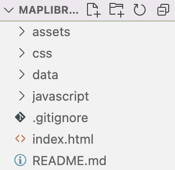

# Maplibre GeoJSON toggle map

### This repository stores code that produces a map that renders GeoJSON data and allows users to subset data. Here is a live version of the map: <https://casmacdo.github.io/maplibre_toggle_map/>

### Below, I describe how site works

The webpage uses JavaScript, HTML, and CSS. In this repository, I've stored the files that produce the website.

I've organized the files into folders by type, and the website's main html file is in the root folder.

<p align="center" >
  
</p>

Below, I list and describe the folders and files shown above.

1. assets
    - A Folder containing media files to produce the site like the favicon 🐶.
2. css
    - A folder containg css files
3. data
    - A folder containg GeoJSON equity data for the map
4. JavaScript
    - A folder containing JavaScript functions that help produce the site
5. .gitignore
    - A file that defines which files or folders git should ignore. For example, files in this folder will not be uploaded to github.
6. index.html
    - The html file that the browser renders. This file defines how the website works and looks.
7. README.md
    - The markdown file that you are currently reading

The most important file in this repository is index.html.

Beyond defining the webpage's structure, it compels the browser to load the remote JavaScript files that the browser uses to produce the map.

```html
<!-- below is the script tag that tells the browser to load the maplibregl JavaScript files  -->
<script src='https://unpkg.com/maplibre-gl@latest/dist/maplibre-gl.js'></script> 

```

In effect, this script tag loads the maplibre JavaScript files from a server and stores them in the user's browser. If one wanted to not include remote resources in their code, they could download the source files before publishing the website and store them in the website's directory.

More info to come...
